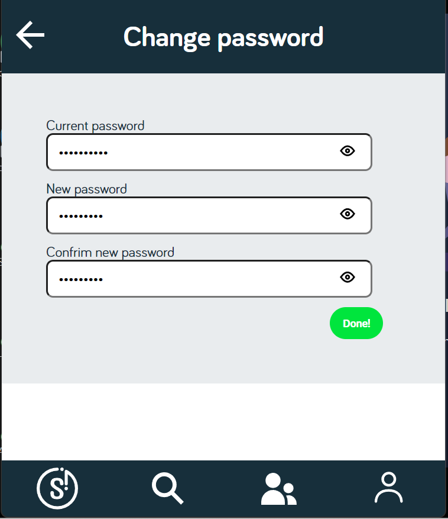
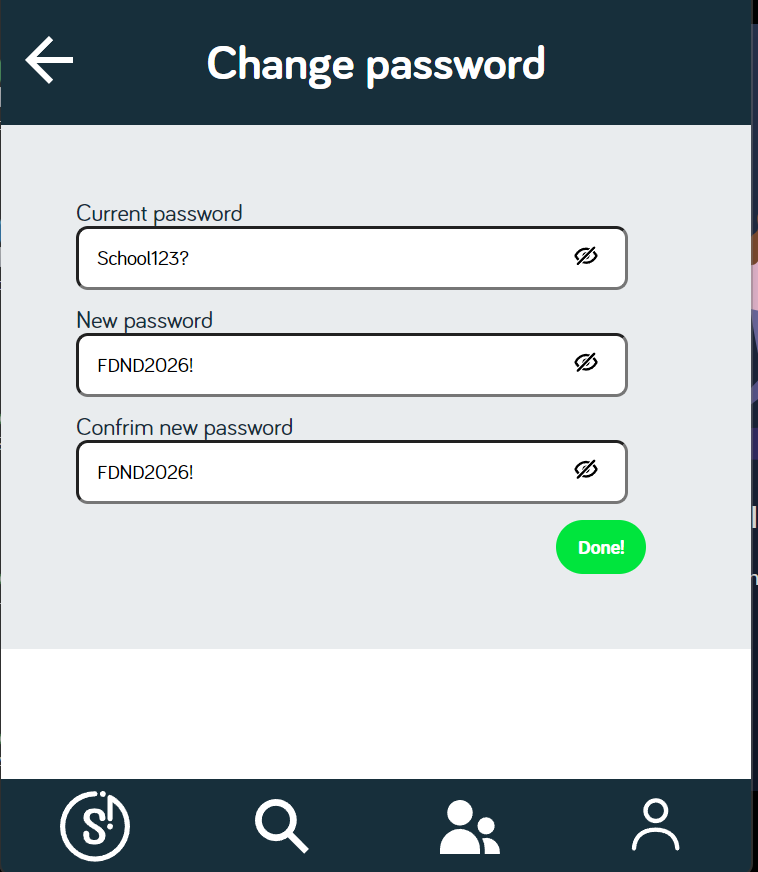

De instructie vind je in: [INSTRUCTIONS.md](https://github.com/fdnd-task/fix-the-flow-interactive-website/blob/main/docs/INSTRUCTIONS.md)

# Titel
Password Visibility Toggle – JavaScript interactie

## Beschrijving
Deze pagina is gemaakt voor het project *SnappThis*. 
SnappThis is een webapplicatie waarin gebruikers snappmaps kunnen maken en foto’s daaraan kunnen toevoegen.

Voor de opdracht *ontwerp en maak een interactie voor de opdrachtgever* heb ik
een password toggle ontworpen en gebouwd binnen de *Change Password*-functionaliteit.
De gebruiker kan hier drie wachtwoordvelden invullen:
- Current password
- New password
- Confirm new password
Verder heb ik gewerkt aan de password security validation gewerkt, dit is belangrijk omdat een password aan bepaalde eisen moet voldoen.
-Het wachtwoord moet minimaal 8 karakters zijn, een nummer bevatten en een speciaal karakter (bijv. !@#$%^&)

Door op een icoon te klikken kan de gebruiker het wachtwoord tonen of verbergen.
Dit maakt het invullen overzichtelijker en helpt om typfouten te voorkomen.

## UI-ontwerpkeuze
Mijn UI-ontwerpkeuze is een password toggle waarmee gebruikers hun wachtwoord kunnen bekijken en weer verbergen. Dit maakt het invullen makkelijker voor de gebruiker en voorkomt fouten. De uitwerking hiervan is terug te zien in mijn GitHub commits en in de HTML, CSS en JavaScript die ik heb gebruikt.

### Wireflow
Password toggle:
  
  
#### User Story
* As a student, I want to toggle the visibility of content so that I can choose when I can see or hide certain information.
* As a student I want my password to meet security requirments (numbers and special characters) so that the account is protected from unauthorized access.

#### Wat je met dit project kan: 
* Wachtwoorden zichtbaar maken
* Wachtwoorden verbergen
* Directe visuele feedback krijgen via een icoon
* Veilig controleren wat je hebt ingevoerd
  

### screenshot

### Toegankelijkheid
- De password toggle is bereikbaar via het toetsenbord (tab-navigatie).
- De toggle-button krijgt een zichtbare focus state, zodat duidelijk is welk element actief is.
- Labels zijn correct gekoppeld aan de inputvelden met `for=""`, wat ondersteuning biedt voor screenreaders.
- Het tonen en verbergen van het wachtwoord helpt gebruikers om invoer te controleren en fouten te voorkomen.

#### Hier is een link naar mijn live link op github: 
https://hebaahx.github.io/fix-the-flow-interactive-website/password.html

## Kenmerken
#### HTML
- Semantische structuur met <form>, <label> en <input>
- Drie inputvelden met type="password"
- Toggle-button/icoon naast elk wachtwoordveld
- Labels gekoppeld met for="" → toegankelijkheid

#### CSS
- Styleguide gebruikt voor consistente look & feel
- Duidelijke layout voor formulieren
- Icoon verandert mee bij tonen/verbergen (via classes)

#### JavaScript Interactie:
De password toggle is opgebouwd in drie stappen.

- Stap 1 - Elementen selecteren, Ik gebruik document.querySelector() om alle buttons die bij de wachtwoordvelden horen te selecteren.
https://github.com/hebaahx/fix-the-flow-interactive-website/blob/ea7767e2f92c2cd53c117aa78808c76b1898cb96/password.js#L2

- Stap 2 - Click event toevoegen addEventListener(), Hier luisteren de buttons naar de klik op het icoon/svg.
https://github.com/hebaahx/fix-the-flow-interactive-website/blob/0f1945e7582a259ceec3acbf3d902457f3ba58a8/password.js#L6-L8

- Stap 3 – Password tonen/verbergen
https://github.com/hebaahx/fix-the-flow-interactive-website/blob/ea7767e2f92c2cd53c117aa78808c76b1898cb96/password.js#L9-L27
In deze stap:
- Haal ik via een data-input attribuut het juiste inputveld op
- Wissel ik het inputtype tussen password en text
- Verander ik het icoon zodat de gebruiker visuele feedback krijgt
- Zo weet de gebruiker altijd of het wachtwoord zichtbaar of verborgen is.

  
### De password security validation controleert of:
- Het wachtwoord minimaal 8 karakters bevat
- Er een cijfer aanwezig is
- Er een speciaal karakter aanwezig is
 De gebruiker krijgt directe feedback, zodat duidelijk is of het wachtwoord sterk genoeg is voordat het formulier wordt verzonden.

## Bronnen
- https://www.javascripttutorial.net/javascript-dom/javascript-toggle-password-visibility/
- https://codepen.io/roelmagdaleno/pen/eYjzraV
- https://developer.mozilla.org/en-US/docs/Web/API/Document/querySelector
- https://developer.mozilla.org/en-US/docs/Web/API/Element/classList

## Licentie
This project is licensed under the terms of the [MIT license](./LICENSE).

